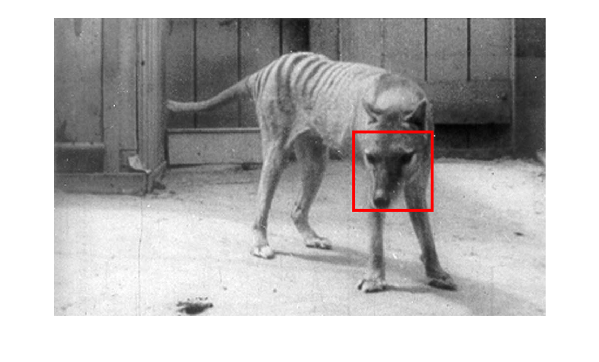
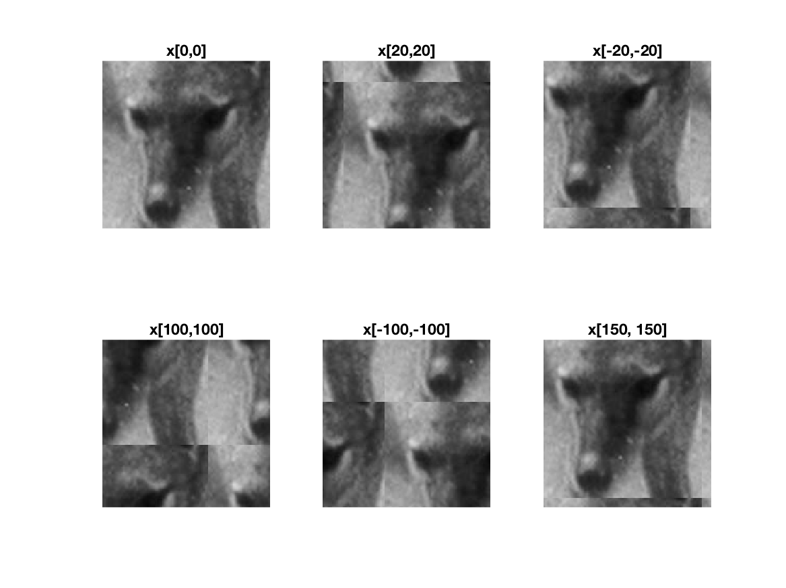
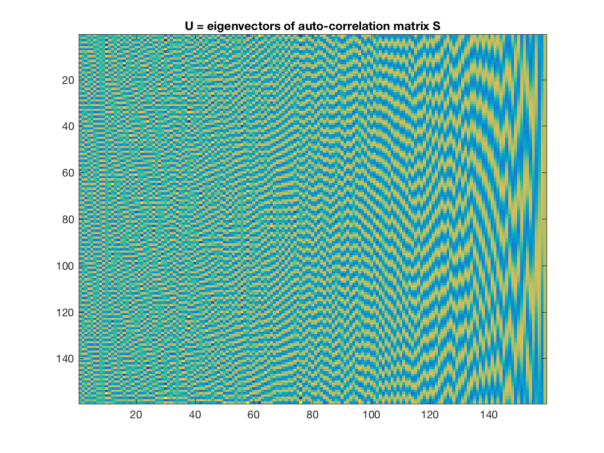
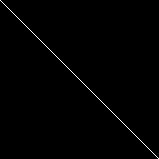
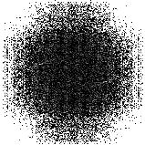

===
Code for testing the relationship between Fast Fourier Transform and Correlation
===

Run `fft_auto_correlate.m`. Image results are as follows:

Selected template:

Examples of circular shifts:

Eigenvectors of the auto-correlation matrix `S`:

Diagnolizing the matrix `S` using eigenvectors of `S`:

FFT of the template `x`:

References:
1. Tasmanian Tiger image from http://www.thylacineresearchunit.org/Photos-PH-PH30-5s-30-5846c.jpg
2. Code inspired from http://16623.courses.cs.cmu.edu/slides/Lecture_14.pdf

